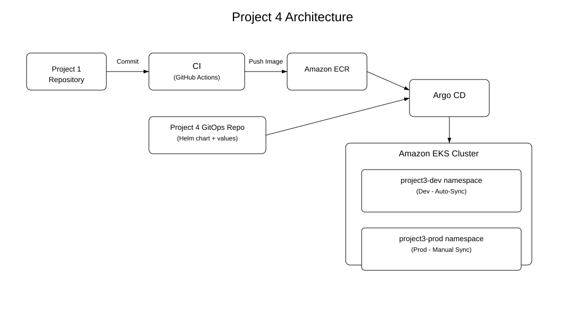

# Project 4 — Helm + Argo CD GitOps Deployment



This project extends the CI → GitOps → Argo CD → EKS deployment model by introducing **Helm** as the packaging and deployment mechanism for the application. It demonstrates how an existing GitOps environment (created in Project 3 using Kustomize) can be seamlessly migrated to Helm while preserving all environments and namespaces.

---

## 1. Repository Structure

```
project4-helm-argo-gitops/
│
├── charts/
│   └── app/
│       ├── Chart.yaml
│       ├── values.yaml
│       ├── values-dev.yaml
│       ├── values-prod.yaml
│       └── templates/
│           ├── deployment.yaml
│           ├── service.yaml
│           ├── ingress.yaml
│           ├── hpa.yaml
│           ├── serviceaccount.yaml
│           ├── tests/test-connection.yaml
│           └── _helpers.tpl
│
└── argo-apps/
    ├── app-dev.yaml
    └── app-prod.yaml
```

---

## 2. Deployment Flow (High-Level)

1. A developer pushes code to the **Project 1** repository on a GitOps integration branch.
2. GitHub Actions builds a Docker image and pushes it to Amazon ECR.
3. The pipeline checks out this repository and updates the image tag inside `values-dev.yaml`.
4. The change is pushed to the `project4-gitops` branch.
5. Argo CD detects the change and **auto-syncs the dev environment**.
6. For production:
   - Update `values-prod.yaml` manually.
   - Sync the `project4-app-prod` Application in the Argo CD UI.

This creates a clear workflow:
- **Continuous deployment** to dev  
- **Controlled promotion** to prod  

---

## 3. Helm Chart Overview

The Helm chart under `charts/app/` generates all Kubernetes objects for the application, including:

| Template | Purpose |
|---------|---------|
| `deployment.yaml` | Application Deployment, env overrides, autoscaling logic |
| `service.yaml` | ClusterIP Service |
| `ingress.yaml` | AWS ALB Ingress with ACM + HTTPS |
| `hpa.yaml` | Horizontal Pod Autoscaler (prod only) |
| `serviceaccount.yaml` | ServiceAccount with annotation support |
| `_helpers.tpl` | Name/label helpers |
| `tests/test-connection.yaml` | Helm test hook |

### Values Strategy

- `values.yaml` → base defaults  
- `values-dev.yaml` → dev overrides  
- `values-prod.yaml` → prod overrides  

This maintains an environment‑aware but unified chart.

---

## 4. Environment Differences

### Dev
- 1 replica  
- Autoscaling disabled  
- Auto-sync enabled  
- URL: **https://project4-dev.seanxtopher.com**

### Prod
- Autoscaling enabled (HPA: 2–8 replicas @ 60% CPU)  
- Manual sync  
- URL: **https://project4-prod.seanxtopher.com**

---

## 5. Argo CD Applications

### `project4-app-dev` (`argo-apps/app-dev.yaml`)
- Auto-sync, prune, self-heal  
- Uses `values-dev.yaml`  
- Deploys to namespace: **project3-dev**

### `project4-app-prod` (`argo-apps/app-prod.yaml`)
- Manual sync  
- Uses `values-prod.yaml`  
- Deploys to namespace: **project3-prod**

---

## 6. CI/CD Integration (From Project 1)

The GitHub Actions workflow in Project 1:

1. Builds the image  
2. Pushes it to ECR  
3. Updates `charts/app/values-dev.yaml` in this repo with the commit SHA  
4. Pushes to branch `project4-gitops`  

Argo CD then deploys the updated dev environment automatically.

Prod deployment requires editing `values-prod.yaml` and manually syncing.

---

## 7. Ingress / ALB / HTTPS

The Helm chart configures AWS Load Balancer Controller with:

- ACM TLS certificate  
- HTTPS enforced via redirect  
- Internet-facing ALB  
- IP-target mode  
- Host-based routing  

This mirrors production-grade ALB ingress patterns.

---

## 8. Namespaces — Demonstrating Migration from Project 3

This project intentionally deploys to the **same namespaces created during Project 3**:

- `project3-dev`
- `project3-prod`

### Why?

This project intentionally demonstrates a tooling migration from Kustomize to Helm while preserving existing environments and infrastructure.

> **Project 3:** Kustomize‑based GitOps  
> →  
> **Project 4:** Helm‑based GitOps

Organizations frequently standardize on Helm or move from overlays to charts.  
Instead of changing clusters or environments, they:

1. Keep the same namespaces  
2. Keep the same Argo CD Applications  
3. Change *only* the deployment mechanism  
4. Allow Argo CD to continue managing the environment non-disruptively  

This project demonstrates that upgrade path exactly.

---

## 9. Horizontal Pod Autoscaling (Prod Only)

Prod uses an HPA with:
- Minimum replicas: 2  
- Maximum replicas: 8  
- CPU target: 60%  

Dev does not use autoscaling to keep resource usage minimal.

---

## 10. Summary

Project 4 demonstrates a Helm-based GitOps deployment model using Argo CD, with automated delivery to development and controlled, manual promotion to production.

It builds on earlier GitOps patterns by replacing Kustomize with Helm while preserving existing environments, namespaces, and operational workflows.

